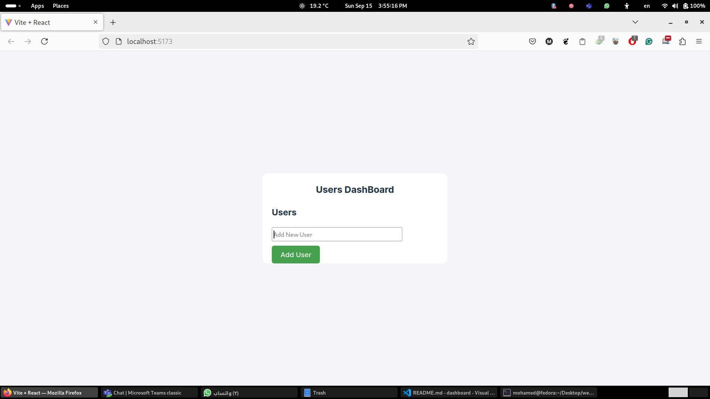
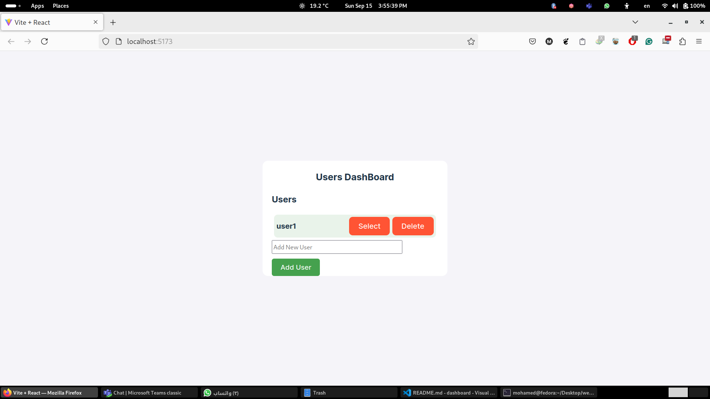
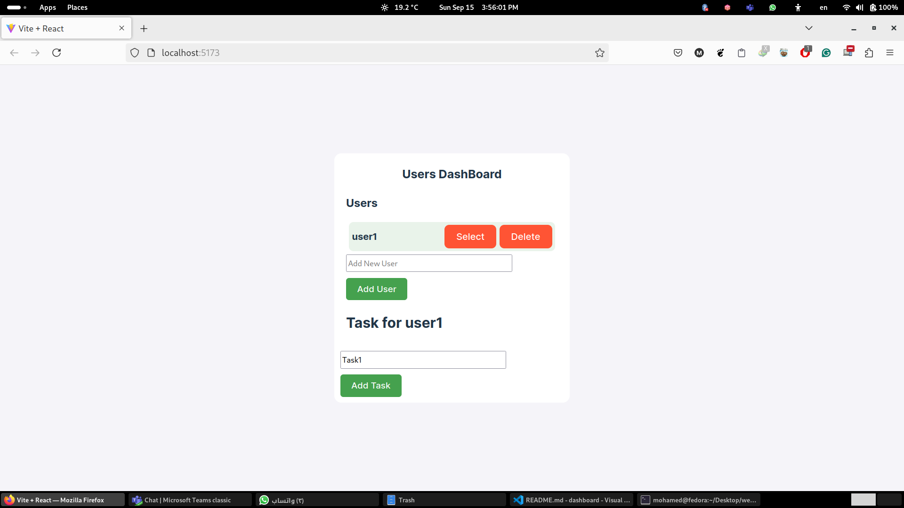
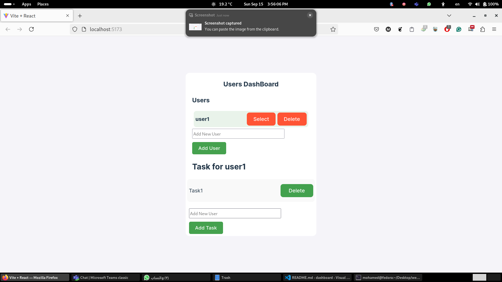
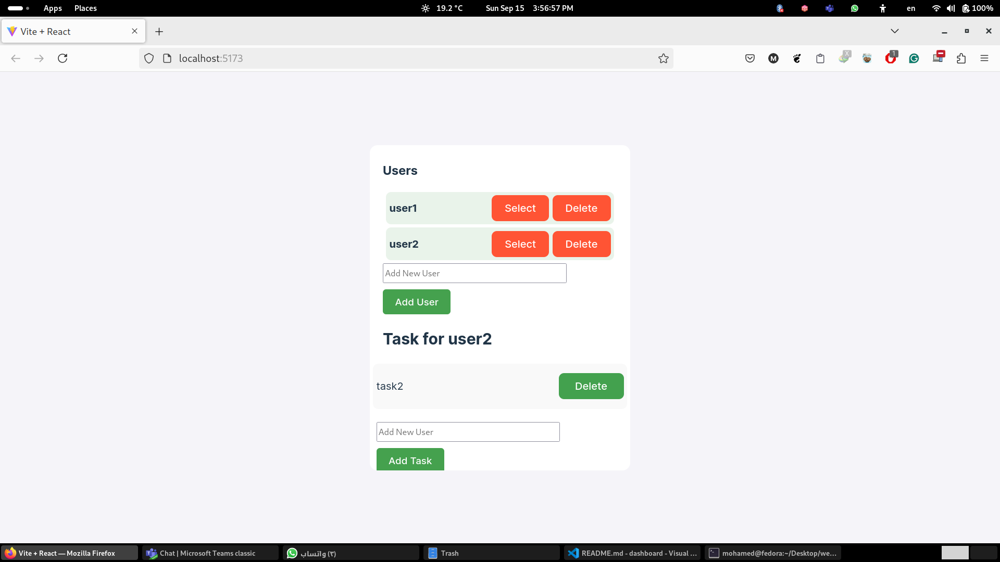
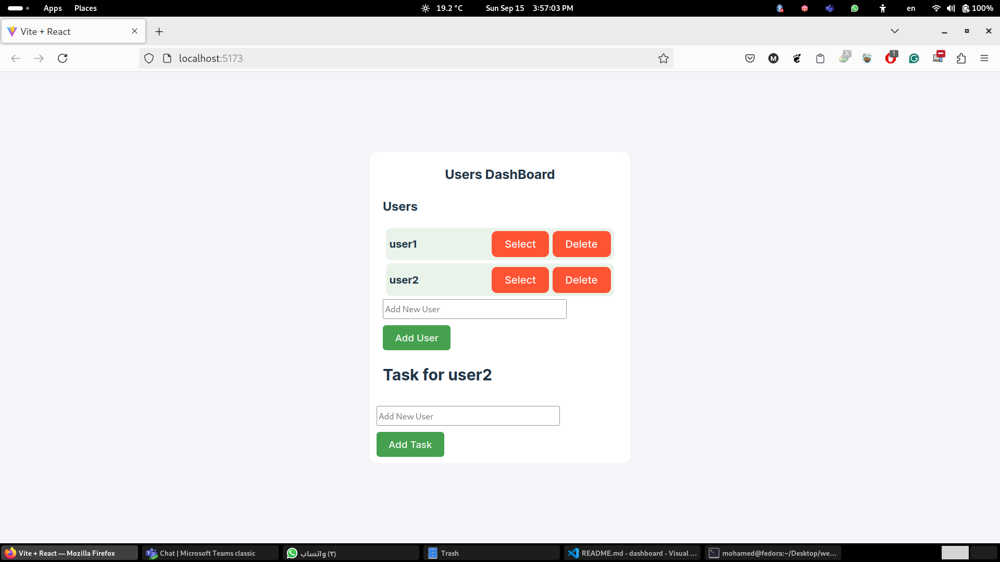

# Simple DashBoard
# Description
 this project it simple dashboard with no backend .

 it is use React with hooks (useEffect,useState)

 this project enable you to add user and add task to them

 delete user and task
## Skills
- HTML
- Javascript
- CSS
- HTML5

# Screens:

